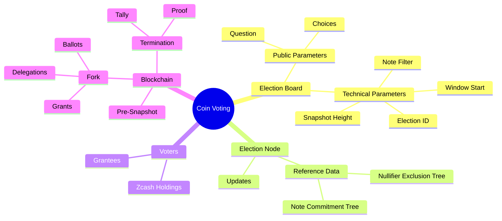

# Mindmap

Here's a short description on the role of each major component.

## Election Board

The election board is the governing body responsible for overseeing the administration of 
the elections. Normally, its main duties include:

- Managing Voter Registration: Ensuring that only eligible ZEC holders can participate.
This is done through cryptography instead.
- Administering Elections: Organizing and managing the logistics of the process. Running
the Election Nodes and the information website if any.
- Counting Votes: Using the software and publishing the results
- Certifying Election Results: Providing the cryptographic proofs and the means to verify
them

## Voters

- Any Zcash holder can vote with a voting power equal to their holdings.
- Only coins in the *Orchard* pool at the time of the snapshot
are usable.
- Voters cast their votes using an app or their wallet (if it integrates
the voting library)
- Individuals may receive additional voting power from the Election Board.
- Voting Power can be delegated, i.e. sent to another user.

::: info
Voting Power has no monetary value and can be only used in a particular
election
:::

::: warning
At this time, there is no mechanism to *restrict* voting to a particular
group of users. It may be considered if there is an interest for a model of 
indirect elections with super representatives.
:::

## Blockchain

Most of the data comes from the blockchain. Conceptually, the coin voting
considers transaction *outputs* from Orchard as source of voting power (VP),
transaction *inputs* as a destruction of voting power.

Then at the snapshot height, the blockchain forks and a different "timeline" forms. 
On this branch, participants trade VP (delegations) and eventually spend it
on proposals.

The fork is managed by the Election Board via the Election Node app.

## Election Nodes

The Election Node implements the Voting Protocol. It has similar responsibilities
to the Zcash full node but without mining, p2p and block schedule.

Via the Election Nodes,

- Voters receive delegated VP
- Voters submit their ballots
